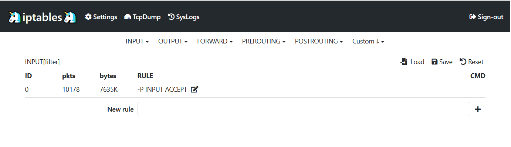

iptables WEB gui



### Howto install ###

In first time you need to ...
* Download and install Node.js
* Install PAM libraries

  - Centos and RHEL
    ```sh
    yum install pam-devel
    ```
  - Debian/Ubuntu
    ```sh
    apt-get install libpam0g-dev
    ```
  - debian6/maverick/natty
    ```sh
    apt-get install libreadline5-dev
    ```
  - oneiric (and any newer, eg. Debian 7 or Ubuntu 12.04)
    ```sh
    apt-get install libreadline-gplv2-dev
    ```

### Howto use ###
* Clone repository:
```bash
git clone https://github.com/puux/iptables.git
```
* Run server:
```bash
cd iptables
# only for first time you, need to download dependancies
npm install
# and then you can start the server
node server.js
```
* Open browser and goto http://127.0.0.1:1337/

### user and password ###

You can sign in with Linux user account.